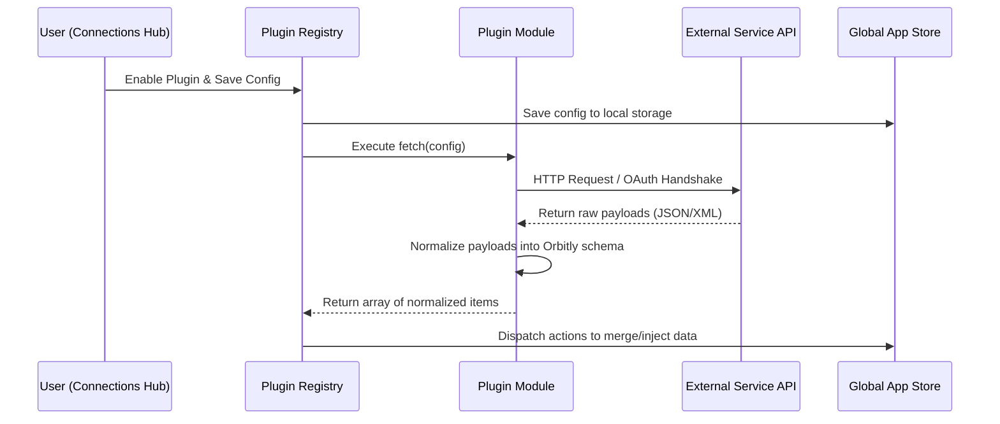

# Orbitly Plugin Contract & Architecture (Phase 22+)

This document defines the interface and integration patterns for the Orbitly Plugin SDK. The plugin engine enables third-party developers and curated integrations to dynamically register sections, inject data into the core state (calendar, tasks, recipes), and expose configuration options via the Connections Hub.

---

## 1. Plugin Module Structure

A plugin must be implemented as a JavaScript module (or ESM) that exports a default object adhering to the following interface:

```typescript
interface OrbitlyPlugin {
  // Unique identifier for the plugin (e.g. 'google-calendar', 'strava')
  id: string;

  // Human-readable name displayed in settings and cards
  name: string;

  // Inline SVG markup or a React component rendering the logo icon
  icon: string | React.ComponentType;

  // Core sections this plugin hooks into or defines (e.g. ['calendar', 'tasks'])
  sections: string[];

  // Types of data injected into the Orbitly life operating system state
  dataTypes: ('events' | 'tasks' | 'recipes' | 'habits')[];

  // Schema defining the parameters required to run/authenticate the plugin
  configSchema: {
    type: 'object';
    properties: {
      [key: string]: {
        type: 'string' | 'boolean' | 'number';
        title: string;
        description?: string;
        required?: boolean;
        placeholder?: string;
      };
    };
  };

  // Execution hook to retrieve data from the source API.
  // Receives user-configured values matching configSchema.
  fetch(config: Record<string, any>): Promise<PluginData[]>;
}
```

---

## 2. Dynamic Integration Workflow

When a plugin is enabled and configured, the Orbitly Plugin Registry manages its lifecycle:



---

## 3. Data Injection Schemas

The registry expects returning objects from `fetch()` to map directly to Orbitly's standard database and state models:

### 3.1 `events` (Calendar Integration)
```javascript
{
  id: string,               // Unique ID (e.g., 'plugin_name_123')
  title: string,            // Event description/subject
  date: string,             // 'YYYY-MM-DD'
  time: string,             // 'HH:MM' (24h, optional)
  endTime: string,          // 'HH:MM' (24h, optional)
  location: string,         // Event venue (optional)
  description: string,      // Rich details (optional)
  category: 'custom_ics' | string
}
```

### 3.2 `tasks` (Kanban Board Integration)
```javascript
{
  id: string,
  title: string,
  priority: 'Urgent' | 'High' | 'Normal' | 'Low',
  due: string,              // 'YYYY-MM-DD' (optional)
  status: 'todo' | 'doing' | 'done',
  list: 'workTasks' | 'personalTasks'
}
```

### 3.3 `recipes` (Food Planner Integration)
```javascript
{
  id: string,
  title: string,
  category: string,
  cuisine: string,
  servings: number,
  ingredients: string[],    // e.g. ["200g Rice", "2 Eggs"]
  steps: string[],          // step-by-step instructions
  sourceType: string        // e.g. 'TheMealDB' or Plugin ID
}
```

---

## 4. Settings Configuration Renderer

The Connections Hub dynamically evaluates `configSchema` to render customized form elements for each registered plugin, eliminating the need to write custom HTML/React views per integration:

- **String properties** render as `<input type="text" />` (or passwords for secrets).
- **Boolean properties** render as `<input type="checkbox" />` toggles.
- **Select fields** render dropdown options.

---

## 5. Directory Registry

All active plugins reside under `src/plugins/` and are registered in the main registry index file:
- `src/plugins/index.js`: Central registry routing active plugins, bootstrapping tasks, and scheduling hourly background fetch workers.
